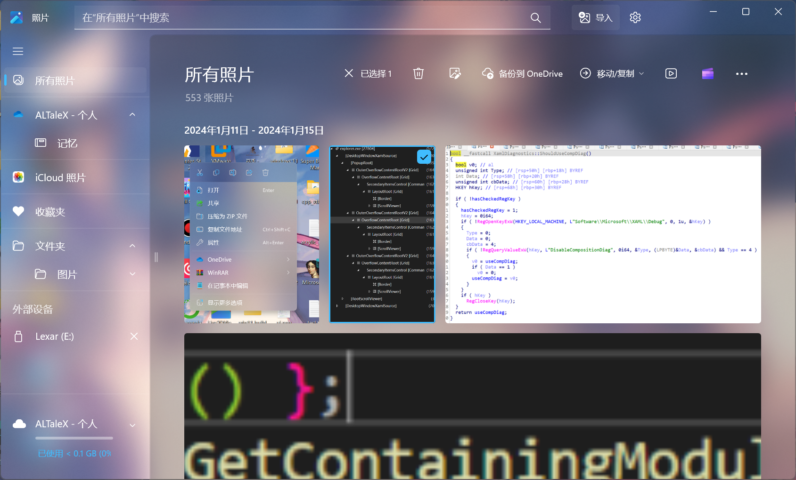

# TranslucentUWP
This repo demonstrates how to change the mica effect of those UWP/WinUI apps to our favorite acrylic effect. It doesn't use XAML diagnostics, thus avoiding its internal bugs.

This repository is now deprecated because I don't have time to maintain it...
## Example
